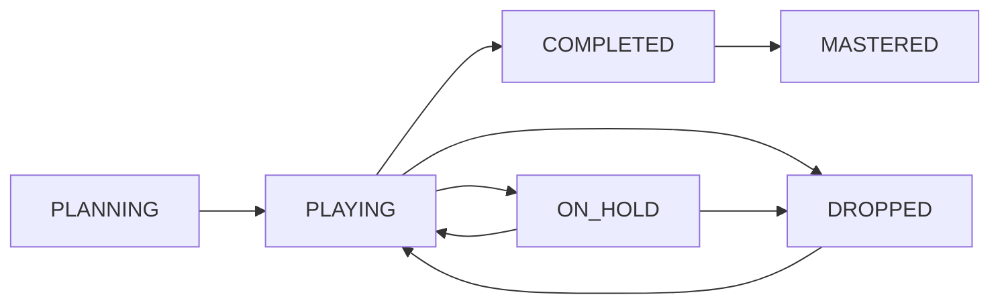

# Playthrough Management API Endpoints

## Overview

The Playthrough Management API handles individual play sessions and attempts for games. This enables users to track multiple playthroughs of the same game with different statuses, platforms, and completion details.

## Base Path
```
/api/v1/playthroughs
```

## Authentication
All playthrough endpoints require valid session authentication via secure HTTP-only cookies.

## Endpoints

### Get User Playthroughs
Get user's playthroughs with advanced filtering options.

```http
GET /api/v1/playthroughs
```

#### Query Parameters
| Parameter | Type | Required | Description |
|-----------|------|----------|-------------|
| `status` | `PlaythroughStatus[]` | No | Filter by playthrough status |
| `platform` | `string[]` | No | Filter by platforms (PS5, Steam, Xbox, Switch) |
| `rating_min` | `int` | No | Minimum rating (1-10) |
| `rating_max` | `int` | No | Maximum rating (1-10) |
| `play_time_min` | `float` | No | Minimum play time in hours |
| `play_time_max` | `float` | No | Maximum play time in hours |
| `difficulty` | `string[]` | No | Filter by difficulty settings |
| `playthrough_type` | `string[]` | No | Filter by playthrough type |
| `started_after` | `date` | No | Started after date (YYYY-MM-DD) |
| `started_before` | `date` | No | Started before date (YYYY-MM-DD) |
| `completed_after` | `date` | No | Completed after date (YYYY-MM-DD) |
| `completed_before` | `date` | No | Completed before date (YYYY-MM-DD) |
| `search` | `string` | No | Search in game titles and notes |
| `limit` | `int` | No | Number of items (max 100, default 20) |
| `offset` | `int` | No | Pagination offset (default 0) |
| `sort_by` | `PlaythroughSortBy` | No | Sort field (default: updated_at) |
| `sort_order` | `SortOrder` | No | Sort direction (asc/desc, default: desc) |

#### Response
```json
{
  "items": [
    {
      "id": "play_abc123",
      "user_id": "usr_xyz789",
      "game": {
        "id": "game_456",
        "title": "Elden Ring",
        "cover_image_id": "co2lbd",
        "release_date": "2022-02-25",
        "main_story": 60,
        "main_extra": 90,
        "completionist": 140
      },
      "collection": {
        "id": "col_def456",
        "platform": "PS5",
        "acquisition_type": "DIGITAL"
      },
      "status": "COMPLETED",
      "platform": "PS5",
      "started_at": "2024-03-15T10:30:00Z",
      "completed_at": "2024-04-20T15:45:00Z",
      "play_time_hours": 85.5,
      "playthrough_type": "First Run",
      "difficulty": "Normal",
      "rating": 9,
      "notes": "Incredible game, loved the exploration",
      "created_at": "2024-03-15T10:30:00Z",
      "updated_at": "2024-04-20T15:45:00Z"
    }
  ],
  "total_count": 89,
  "limit": 20,
  "offset": 0,
  "filters_applied": {
    "status": ["COMPLETED"],
    "rating_min": 8
  }
}
```

#### Status Codes
- `200 OK` - Success
- `400 Bad Request` - Invalid query parameters
- `401 Unauthorized` - Authentication required
- `422 Unprocessable Entity` - Validation errors

---

### Create New Playthrough
Start a new playthrough for a game.

```http
POST /api/v1/playthroughs
```

#### Request Body
```json
{
  "game_id": "game_456",
  "collection_id": "col_def456",
  "platform": "PS5",
  "status": "PLANNING",
  "playthrough_type": "First Run",
  "difficulty": "Normal",
  "notes": "Excited to finally start this!"
}
```

#### Response
```json
{
  "id": "play_abc123",
  "user_id": "usr_xyz789",
  "game_id": "game_456",
  "collection_id": "col_def456",
  "status": "PLANNING",
  "platform": "PS5",
  "started_at": null,
  "completed_at": null,
  "play_time_hours": null,
  "playthrough_type": "First Run",
  "difficulty": "Normal",
  "rating": null,
  "notes": "Excited to finally start this!",
  "created_at": "2024-03-15T10:30:00Z",
  "updated_at": "2024-03-15T10:30:00Z"
}
```

#### Status Codes
- `201 Created` - Playthrough created successfully
- `400 Bad Request` - Invalid request data
- `401 Unauthorized` - Authentication required
- `404 Not Found` - Game or collection not found
- `422 Unprocessable Entity` - Validation errors

#### Validation Rules
- `game_id` must exist in games table
- `collection_id` must belong to current user if provided
- `platform` is required and non-empty
- `status` must be valid enum value
- `rating` must be 1-10 if provided
- `play_time_hours` must be >= 0 if provided

---

### Get Playthrough Details
Get specific playthrough by ID.

```http
GET /api/v1/playthroughs/{playthrough_id}
```

#### Path Parameters
| Parameter | Type | Required | Description |
|-----------|------|----------|-------------|
| `playthrough_id` | `string` | Yes | Playthrough UUID |

#### Response
```json
{
  "id": "play_abc123",
  "user_id": "usr_xyz789",
  "game": {
    "id": "game_456",
    "title": "Elden Ring",
    "cover_image_id": "co2lbd",
    "release_date": "2022-02-25",
    "description": "A fantasy action RPG set in the Lands Between...",
    "main_story": 60,
    "main_extra": 90,
    "completionist": 140,
    "igdb_id": 119171,
    "hltb_id": 68151
  },
  "collection": {
    "id": "col_def456",
    "platform": "PS5",
    "acquisition_type": "DIGITAL",
    "acquired_at": "2024-03-15T10:30:00Z"
  },
  "status": "COMPLETED",
  "platform": "PS5",
  "started_at": "2024-03-15T10:30:00Z",
  "completed_at": "2024-04-20T15:45:00Z",
  "play_time_hours": 85.5,
  "playthrough_type": "First Run",
  "difficulty": "Normal",
  "rating": 9,
  "notes": "Incredible game, loved the exploration and boss fights. The world design is phenomenal.",
  "milestones": [
    {
      "name": "First Boss Defeated",
      "achieved_at": "2024-03-16T14:20:00Z"
    },
    {
      "name": "Elden Lord",
      "achieved_at": "2024-04-20T15:45:00Z"
    }
  ],
  "created_at": "2024-03-15T10:30:00Z",
  "updated_at": "2024-04-20T15:45:00Z"
}
```

#### Status Codes
- `200 OK` - Success
- `401 Unauthorized` - Authentication required
- `404 Not Found` - Playthrough not found or not owned by user

---

### Update Playthrough
Update playthrough details and progress.

```http
PUT /api/v1/playthroughs/{playthrough_id}
```

#### Path Parameters
| Parameter | Type | Required | Description |
|-----------|------|----------|-------------|
| `playthrough_id` | `string` | Yes | Playthrough UUID |

#### Request Body
```json
{
  "status": "PLAYING",
  "started_at": "2024-03-16T09:00:00Z",
  "play_time_hours": 12.5,
  "notes": "Just defeated Margit, this game is amazing!",
  "difficulty": "Hard"
}
```

#### Response
```json
{
  "id": "play_abc123",
  "user_id": "usr_xyz789",
  "game_id": "game_456",
  "collection_id": "col_def456",
  "status": "PLAYING",
  "platform": "PS5",
  "started_at": "2024-03-16T09:00:00Z",
  "completed_at": null,
  "play_time_hours": 12.5,
  "playthrough_type": "First Run",
  "difficulty": "Hard",
  "rating": null,
  "notes": "Just defeated Margit, this game is amazing!",
  "created_at": "2024-03-15T10:30:00Z",
  "updated_at": "2024-03-17T11:30:00Z"
}
```

#### Status Codes
- `200 OK` - Updated successfully
- `400 Bad Request` - Invalid request data
- `401 Unauthorized` - Authentication required
- `404 Not Found` - Playthrough not found
- `422 Unprocessable Entity` - Validation errors

#### Validation Rules
- `completed_at` must be after `started_at` if both provided
- `rating` must be 1-10 if provided
- `play_time_hours` must be >= 0 if provided
- Status transitions must follow logical flow (see status transition rules below)
- Cannot modify `game_id` or `collection_id`

---

### Complete Playthrough
Mark playthrough as completed with final details.

```http
POST /api/v1/playthroughs/{playthrough_id}/complete
```

#### Path Parameters
| Parameter | Type | Required | Description |
|-----------|------|----------|-------------|
| `playthrough_id` | `string` | Yes | Playthrough UUID |

#### Request Body
```json
{
  "completed_at": "2024-04-20T15:45:00Z",
  "final_play_time_hours": 85.5,
  "rating": 9,
  "final_notes": "One of the best games I've ever played. The world design, gameplay, and story all come together perfectly.",
  "completion_type": "COMPLETED"
}
```

#### Response
```json
{
  "id": "play_abc123",
  "user_id": "usr_xyz789",
  "game_id": "game_456",
  "status": "COMPLETED",
  "platform": "PS5",
  "started_at": "2024-03-15T10:30:00Z",
  "completed_at": "2024-04-20T15:45:00Z",
  "play_time_hours": 85.5,
  "rating": 9,
  "notes": "One of the best games I've ever played. The world design, gameplay, and story all come together perfectly.",
  "updated_at": "2024-04-20T15:45:00Z"
}
```

#### Completion Types
- `COMPLETED` - Finished main story/objectives
- `MASTERED` - 100% completion/platinum trophy
- `DROPPED` - Abandoned playthrough
- `ON_HOLD` - Temporarily paused

#### Status Codes
- `200 OK` - Completed successfully
- `400 Bad Request` - Invalid completion data
- `401 Unauthorized` - Authentication required
- `404 Not Found` - Playthrough not found
- `409 Conflict` - Playthrough already completed

---

### Delete Playthrough
Remove playthrough record.

```http
DELETE /api/v1/playthroughs/{playthrough_id}
```

#### Path Parameters
| Parameter | Type | Required | Description |
|-----------|------|----------|-------------|
| `playthrough_id` | `string` | Yes | Playthrough UUID |

#### Response
```json
{
  "success": true,
  "message": "Playthrough deleted successfully"
}
```

#### Status Codes
- `200 OK` - Deleted successfully
- `401 Unauthorized` - Authentication required
- `404 Not Found` - Playthrough not found

---

### Bulk Playthrough Operations
Perform operations on multiple playthroughs.

```http
POST /api/v1/playthroughs/bulk
```

#### Request Body
```json
{
  "action": "update_status",
  "playthrough_ids": ["play_abc123", "play_def456"],
  "data": {
    "status": "ON_HOLD"
  }
}
```

#### Supported Actions
- `update_status` - Update status for multiple playthroughs
- `update_platform` - Change platform for multiple playthroughs
- `add_time` - Add play time to multiple playthroughs
- `delete` - Delete multiple playthroughs

#### Response
```json
{
  "success": true,
  "updated_count": 2,
  "items": [
    {
      "id": "play_abc123",
      "status": "ON_HOLD"
    },
    {
      "id": "play_def456", 
      "status": "ON_HOLD"
    }
  ]
}
```

#### Status Codes
- `200 OK` - Operation completed
- `400 Bad Request` - Invalid action or data
- `401 Unauthorized` - Authentication required
- `207 Multi-Status` - Partial success (some items failed)

---

## Convenience Endpoints

### Get Backlog
Get games user plans to play.

```http
GET /api/v1/playthroughs/backlog
```

#### Query Parameters
| Parameter | Type | Required | Description |
|-----------|------|----------|-------------|
| `platform` | `string[]` | No | Filter by platforms |
| `priority` | `int[]` | No | Filter by collection priority |
| `limit` | `int` | No | Number of items (default 20) |

#### Response
```json
{
  "items": [
    {
      "id": "play_abc123",
      "game": {
        "id": "game_456",
        "title": "Baldur's Gate 3",
        "cover_image_id": "co5vmg"
      },
      "collection": {
        "platform": "PS5",
        "priority": 1,
        "acquired_at": "2024-03-15T10:30:00Z"
      },
      "status": "PLANNING",
      "created_at": "2024-03-15T10:30:00Z"
    }
  ],
  "total_count": 45
}
```

---

### Get Currently Playing
Get games user is actively playing.

```http
GET /api/v1/playthroughs/playing
```

#### Query Parameters
| Parameter | Type | Required | Description |
|-----------|------|----------|-------------|
| `platform` | `string[]` | No | Filter by platforms |

#### Response
```json
{
  "items": [
    {
      "id": "play_def456",
      "game": {
        "id": "game_789",
        "title": "Cyberpunk 2077",
        "cover_image_id": "co1rgd"
      },
      "status": "PLAYING",
      "platform": "Steam",
      "started_at": "2024-03-10T14:20:00Z",
      "play_time_hours": 23.5,
      "last_played": "2024-03-16T19:30:00Z"
    }
  ],
  "total_count": 3
}
```

---

### Get Completed Games
Get completed playthroughs with optional filters.

```http
GET /api/v1/playthroughs/completed
```

#### Query Parameters
| Parameter | Type | Required | Description |
|-----------|------|----------|-------------|
| `year` | `int` | No | Filter by completion year |
| `rating_min` | `int` | No | Minimum rating (1-10) |
| `platform` | `string[]` | No | Filter by platforms |
| `limit` | `int` | No | Number of items (default 50) |

#### Response
```json
{
  "items": [
    {
      "id": "play_ghi789",
      "game": {
        "id": "game_321",
        "title": "The Witcher 3",
        "cover_image_id": "co1wyk"
      },
      "status": "COMPLETED",
      "platform": "Steam",
      "completed_at": "2024-02-15T20:15:00Z",
      "play_time_hours": 120.0,
      "rating": 10,
      "playthrough_type": "Complete Edition"
    }
  ],
  "total_count": 67,
  "completion_stats": {
    "total_hours": 1450.5,
    "average_rating": 8.2,
    "completion_rate": "85%"
  }
}
```

---

## Playthrough Statistics

### Get Playthrough Statistics
Get user's playthrough statistics and insights.

```http
GET /api/v1/playthroughs/stats
```

#### Response
```json
{
  "total_playthroughs": 89,
  "by_status": {
    "PLANNING": 45,
    "PLAYING": 3,
    "COMPLETED": 37,
    "DROPPED": 3,
    "ON_HOLD": 1
  },
  "by_platform": {
    "PS5": 35,
    "Steam": 42,
    "Xbox": 8,
    "Switch": 4
  },
  "completion_stats": {
    "total_hours_played": 1450.5,
    "average_completion_time": 39.2,
    "completion_rate": 85.2,
    "average_rating": 8.2
  },
  "yearly_stats": {
    "2024": {
      "completed": 12,
      "hours_played": 380.5,
      "average_rating": 8.5
    },
    "2023": {
      "completed": 25,
      "hours_played": 690.0,
      "average_rating": 8.0
    }
  },
  "top_genres": [
    {
      "genre": "RPG",
      "count": 28,
      "average_hours": 65.2
    },
    {
      "genre": "Action",
      "count": 19,
      "average_hours": 35.8
    }
  ]
}
```

---

## Status Transition Rules

### Valid Status Transitions


### Business Rules
- `PLANNING` → `PLAYING`: Sets `started_at` if not set
- `PLAYING` → `COMPLETED`: Requires `completed_at` 
- `PLAYING` → `DROPPED`: Optional `completed_at` (dropped date)
- `ON_HOLD` → `PLAYING`: Resumes playthrough
- `COMPLETED` → `MASTERED`: Upgrade completion level
- Cannot transition directly from `PLANNING` to `COMPLETED`

---

## Data Types

### PlaythroughStatus
```typescript
enum PlaythroughStatus {
  PLANNING = "PLANNING",     // Want to play (backlog)
  PLAYING = "PLAYING",       // Currently playing
  COMPLETED = "COMPLETED",   // Finished main objectives
  DROPPED = "DROPPED",       // Abandoned playthrough
  ON_HOLD = "ON_HOLD",      // Temporarily paused
  MASTERED = "MASTERED"     // 100% completion/platinum
}
```

### PlaythroughSortBy
```typescript
enum PlaythroughSortBy {
  TITLE = "title",
  STATUS = "status",
  STARTED_AT = "started_at",
  COMPLETED_AT = "completed_at",
  UPDATED_AT = "updated_at",
  RATING = "rating",
  PLAY_TIME = "play_time_hours",
  PLATFORM = "platform"
}
```

### PlaythroughType Examples
Common playthrough type values:
- "First Run"
- "New Game+"
- "Speedrun"
- "100% Completion"
- "Challenge Run"
- "Replay"
- "Co-op Playthrough"

### Difficulty Examples
Common difficulty values:
- "Easy"
- "Normal" 
- "Hard"
- "Nightmare"
- "Custom"
- Game-specific difficulties (e.g., "Give Me God of War")

---

## Error Responses

### Standard Error Format
```json
{
  "error": "validation_error",
  "message": "Invalid playthrough data",
  "details": [
    {
      "field": "completed_at",
      "message": "Completed date must be after started date"
    }
  ],
  "timestamp": "2024-03-15T10:30:00Z",
  "request_id": "req_abc123"
}
```

### Playthrough-Specific Errors
- `invalid_status_transition` - Cannot transition between specified statuses
- `completion_required` - Status change requires completion data
- `already_completed` - Playthrough is already marked as completed
- `playthrough_exists` - Similar playthrough already exists for this game

---

## Rate Limiting
- Standard rate limit: 100 requests per minute per user
- Bulk operations: 10 requests per minute per user
- Statistics endpoint: 20 requests per minute per user
- Completion endpoint: 50 requests per minute per user

## Caching
- Playthrough lists cached for 2 minutes
- Individual playthroughs cached for 10 minutes
- Statistics cached for 15 minutes
- Cache invalidated on any playthrough mutations
- Backlog/playing lists cached for 1 minute (frequently changing)