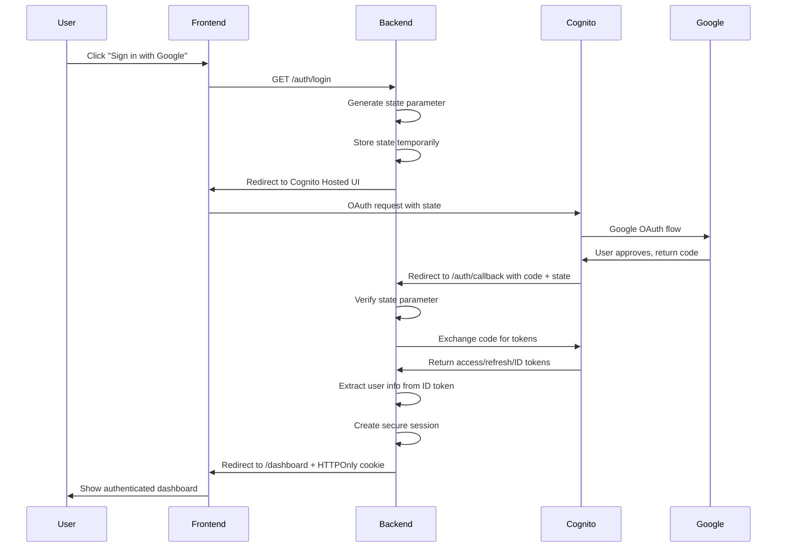

# Authentication Architecture Overview

## Executive Summary

This document outlines three approaches for implementing AWS Cognito with Google OAuth using HTTPOnly cookies for the Play Later application. The goal is secure authentication without storing tokens on the frontend, with auth flow initiated by frontend redirect to Cognito Hosted UI.

## Current State Analysis

### Existing Implementation
- **Documentation**: Comprehensive architecture in `authentication.md` describes full Cognito implementation
- **Code Reality**: Simple stub in `api/app/auth.py` reads from header or cookie
- **Frontend**: No auth components, generic generated API client
- **Infrastructure**: Minimal Terraform setup (empty main.tf)

### Gap Assessment
There's a significant gap between documented architecture and actual implementation. The current stub provides basic auth dependency injection but lacks:
- OAuth integration
- Token validation
- Session management
- Security hardening

## Architecture Approaches

### Approach A: Direct Cognito Integration (Simplest)

**Architecture Flow:**
```
Frontend → Cognito Hosted UI → Frontend Callback → Backend Token Exchange → HTTPOnly Session Cookie
```

**Implementation:**
1. Frontend redirects to Cognito Hosted UI for Google OAuth
2. User completes OAuth, Cognito redirects back with authorization code
3. Frontend sends code to backend `/auth/callback` endpoint
4. Backend exchanges code for tokens with Cognito directly
5. Backend stores session in database/Redis, returns HTTPOnly cookie
6. All API requests use cookie for authentication

**Pros:**
- Straightforward implementation
- Follows OAuth2 authorization code flow correctly
- Direct AWS integration
- Well-documented pattern

**Cons:**
- Backend needs Cognito client credentials
- Token refresh handling required
- More complex error scenarios

**Security Level:** ⭐⭐⭐⭐ (Good)
**Implementation Complexity:** ⭐⭐⭐ (Medium)

### Approach B: Backend Proxy Pattern (Most Secure) ⭐ **RECOMMENDED**

**Architecture Flow:**
```
Frontend → Backend Auth Proxy → Cognito Hosted UI → Backend Callback → Session Management
```

**Implementation:**
1. Frontend calls backend `/auth/login` endpoint
2. Backend generates state, redirects to Cognito with backend callback URL
3. User completes OAuth, Cognito calls backend directly
4. Backend handles token exchange server-side
5. Backend stores session, redirects frontend to success page
6. Frontend never sees tokens or handles OAuth directly

**Pros:**
- Maximum security - tokens never touch frontend
- Centralized session management
- Easier token refresh (background process)
- Better error handling
- CSRF protection built-in

**Cons:**
- More complex routing
- Backend needs session storage
- Additional redirects

**Security Level:** ⭐⭐⭐⭐⭐ (Excellent)
**Implementation Complexity:** ⭐⭐⭐⭐ (High)

### Approach C: Hybrid Session Management (Balanced)

**Architecture Flow:**
```
Frontend → Cognito Hosted UI → Frontend Callback → Backend Session Service → Lightweight Session Token
```

**Implementation:**
1. Frontend redirects to Cognito for OAuth
2. Frontend receives authorization code
3. Frontend calls backend session service with code
4. Backend creates secure session with lightweight session token (not OAuth tokens)
5. Backend stores OAuth tokens securely, maps to session token
6. HTTPOnly cookie contains only session identifier

**Pros:**
- Balance of simplicity and security
- Session tokens are lightweight
- OAuth tokens stored securely server-side
- Good user experience
- Easier debugging

**Cons:**
- Custom session management required
- Two-tier token system adds complexity

**Security Level:** ⭐⭐⭐⭐ (Good)
**Implementation Complexity:** ⭐⭐⭐ (Medium)

## Security Comparison Matrix

| Aspect | Approach A | Approach B | Approach C |
|--------|------------|------------|------------|
| Token Exposure | Authorization code briefly in frontend | No frontend token exposure | Authorization code briefly in frontend |
| XSS Protection | HTTPOnly cookies protect session | HTTPOnly cookies + no frontend tokens | HTTPOnly cookies + lightweight sessions |
| CSRF Protection | SameSite cookies + CSRF tokens needed | Built-in state parameter protection | SameSite cookies + session validation |
| Token Refresh | Frontend-initiated or background | Background server process | Background server process |
| Session Revocation | Database/Redis session invalidation | Centralized session management | Two-tier revocation |
| Audit Trail | Good - API logs auth events | Excellent - all auth server-side | Good - session service logs |

## Recommended Approach: Approach B (Backend Proxy Pattern)

**Reasoning:**
- Meets security requirements (HTTPOnly cookies, no frontend token storage)
- Follows 2025 best practices for AWS Cognito
- Provides maximum protection against XSS attacks
- Simplifies frontend implementation
- Better error handling and user experience
- Scales well for multi-domain scenarios

## Implementation Flow

### Backend Proxy Pattern Flow


## Next Steps

1. **Infrastructure**: Set up AWS Cognito resources using Terraform
2. **Backend**: Implement OAuth handlers and session management
3. **Frontend**: Add authentication components and route protection
4. **Testing**: Validate security and functionality

See the specific implementation documents for detailed code and configuration.